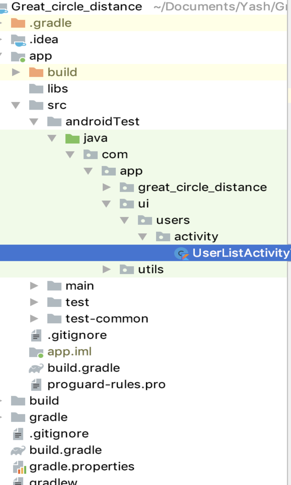
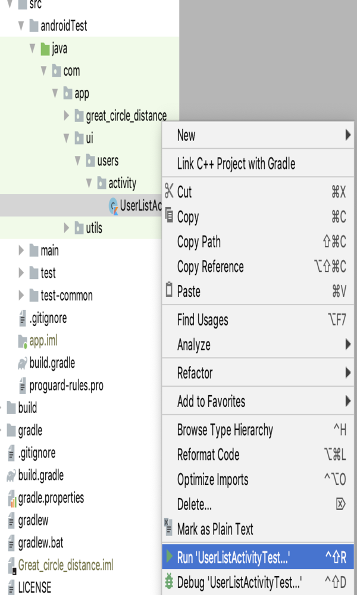
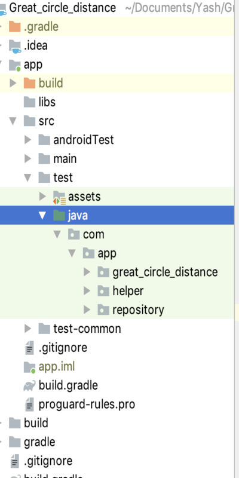
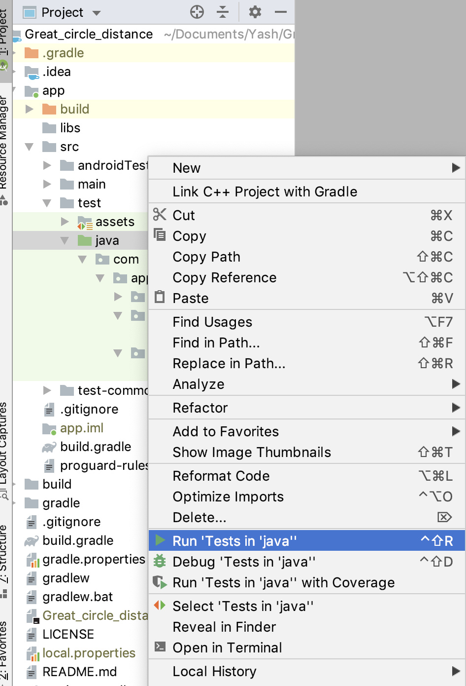

# CircleDistance

This application is built to filter out the customers who are within 100 Kilometers of range using
__[Great-circle distance](https://en.wikipedia.org/wiki/Great-circle_distance)__. The main area is
to read the data from the local user data file and apply the formula and get the result and sorted
by ascending order based on User ID.

# Demo

## Languages, libraries and tools used

* __[Kotlin](https://developer.android.com/kotlin)__
* __[Koin](https://github.com/InsertKoinIO/koin)__
* __[Android Material Design](https://material.io/components/)__
* __[Android Architecture Components](https://developer.android.com/topic/libraries/architecture/index.html)__
* __[Instrumented Unit Testing](https://developer.android.com/training/testing/unit-testing/instrumented-unit-tests)__
* __[Espresso Testing](http://developer.android.com/training/testing/espresso)__

Above Features are used to make code simple, generic, understandable, clean and easily maintainable
for future development.Especially **Koin** for dependency injection

## Automated tests

To run the test you must connect to real device or an emulator then you can choose in one of the following ways:

1. To run a single test, open the Project window, and then right-click a test and click Run.

**Then Click**

2. To run all tests in a directory, right-click on the directory and select Run tests

**Then Click**

## Running and Building the application

You can run the app on a real device or an emulator.

* __[Run on a real device](https://developer.android.com/training/basics/firstapp/running-app#RealDevice)__
* __[Run on an emulator](https://developer.android.com/training/basics/firstapp/running-app#Emulator)__

# Prerequisites
* __Android Studio 3.5__
* __Gradle version 3.5.1__
* __Kotlin version 1.3.50__
* __Android Device with USB Debugging Enabled__

# Built With

* __[Android Studio](https://developer.android.com/studio/index.html)__ - The Official IDE for Android
* __[Kotlin](https://developer.android.com/kotlin)__ - Language used to build the application
* __[Gradle](https://gradle.org)__ - Build tool for Android Studio
